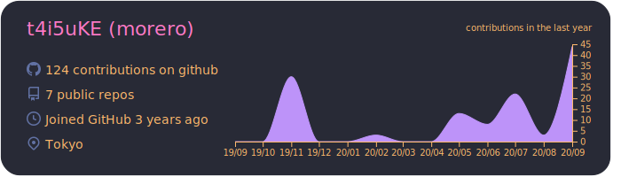
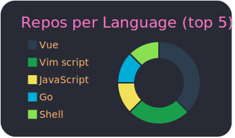
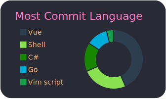
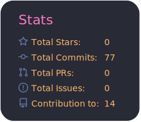

<h1>
 
Hi, I'm t4i5uKE (morero) 

</h1>

 
Welcome to my page !!  
I'm currently working on the infrastructure development in Japan .

<h3>Technology currently / previously used</h3>
<table>
    <thead align="center">
    <tr border: none;>
        <td><b> Category </b></td>
        <td><b> Technology </b></td>
    </tr>
    </thead>
    <tbody>
    <tr>
        <td><b> Cloud </b></td>
        <td>
            <!-- GCP -->
            
            <!-- AWS -->
            
        </td>
    </tr>
    <tr>
        <td><b> Cloud Native </b></td>
        <td>
            <!-- Kubernetes -->
            
            <!-- Docker -->
            
            <!-- Istio -->
            
            <!-- Helm -->
            
            <!-- Prometheus -->
            
            <!-- Grafana -->
            
            <!-- kiali -->
            
            <!-- Jaeger -->
            
        </td>
    </tr>
    <tr>
        <td><b> Database </b></td>
        <td>
            <!-- Redis -->
            
            <!-- MySQL -->
            
            <!-- PostgreSQL -->
            
        </td>
    </tr>
    <tr>
        <td><b> CI Tool </b></td>
        <td>
            
            
        </td>
    </tr>
    <tr>
        <td><b> Programming Languages </b></td>
        <td>
            <!-- Golang -->
            
            <!-- Python -->
             
            <!-- PHP -->
            
            <!-- Java -->
            
            <!-- Clang -->
             
            <!-- C# -->
            
        </td>
    </tr>
    <tr>
        <td><b> Frontend </b></td>
        <td>
            <!-- HTML5 -->
            
            <!-- CSS3 -->
            
            <!-- Vue.js -->
            
            <!-- Bootstrap -->
            
        </td>
    </tr>
    <tr>
        <td><b> Framework </b></td>
        <td>
            <!-- Laravel -->
            
            <!-- Django -->
            
        </td>
    </tr>
    <tr>
        <td><b> Static Site Generators </b></td>
        <td>
            <!-- Nikola -->
            
        </td>
    </tr>
    <tr>
        <td><b> Others </b></td>
        <td>
            <!-- Vagrant -->
            
        </td>
    </tr>
    </tbody>
</table>

<h3> Statistics </h3>

 

    
 Other Statics 

    
    <!--START_SECTION:waka-->
    <！-END_SECTION：waka->

