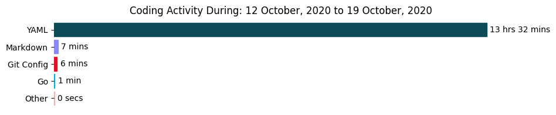

<h1>
 
Hi, I'm t4i5uKE (morero) 

</h1>

<p align="left">
    <!-- GitHub -->
    <a href="https://github.com/t4i5uKE/t4i5uKE/">
        
    </a>
    <a href="https://github.com/t4i5uKE">
        
    </a>
    <!-- Twitter -->
    <a href="http://twitter.com/m0rer0">
        
    </a>
    <!-- Qiita -->
    <a href="http://qiita.com/Morero">
        
    </a>
    <a href="http://qiita.com/Morero">
        
    </a>
</p>

<p> 
Welcome to my page !! <br>
I'm currently working on the infrastructure development in Japan .
</p>

---

<h3> :gear: Technology currently / previously used</h3>

<table align="center">
    <thead align="center">
    <tr border: none;>
        <td><b> Category </b></td>
        <td><b> Technology </b></td>
    </tr>
    </thead>
    <tbody>
    <tr>
        <td><b> Cloud </b></td>
        <td>
            <!-- GCP -->
            <a href="https://cloud.google.com/?hl=ja">
                
            </a>
            <!-- AWS -->
            <a href="https://aws.amazon.com/jp/">
                
            </a>
        </td>
    </tr>
    <tr>
        <td><b> Cloud Native </b></td>
        <td>
            <!-- Kubernetes -->
            <a href="https://kubernetes.io/ja/">
                
            </a>
            <!-- Docker -->
            <a href="https://www.docker.com/">
                
            </a>
            <!-- Istio -->
            <a href="https://istio.io/">
                
            </a>
            <!-- Helm -->
            <a href="https://helm.sh/">
                
            </a>
            <!-- Prometheus -->
            <a href="https://prometheus.io/">
                
            </a>
            <!-- Grafana -->
            <a href="https://grafana.com/grafana/">
                
            </a>
            <!-- kiali -->
            <a href="https://kiali.io/">
                
            </a>
            <!-- Jaeger -->
            <a href="https://www.jaegertracing.io/">
                
            </a>
        </td>
    </tr>
    <tr>
        <td><b> Database </b></td>
        <td>
            <!-- Redis -->
            <a href="https://redis.io/">
                
            </a>
            <!-- MySQL -->
            <a href="https://www.mysql.com/jp/">
                
            </a>
            <!-- PostgreSQL -->
            <a href="https://www.postgresql.org/">
                
            </a>
        </td>
    </tr>
    <tr>
        <td><b> CI Tool </b></td>
        <td>
            <!-- Circle CI -->
            <a href="https://circleci.com/ja/">
                
            </a>
            <!-- Jenkins -->
            <a href="https://www.jenkins.io/">
                
            </a>
        </td>
    </tr>
    <tr>
        <td><b> Programming Languages </b></td>
        <td>
            <!-- Golang -->
            <a href="https://golang.org/">
                
            </a>
            <!-- Python -->
            <a href="https://www.python.org/">
                 
            </a>
            <!-- PHP -->
            <a href="https://www.php.net/">
                
            </a>
            <!-- Java -->
            <a href="https://java.com/ja/">
                
            </a>
            <!-- Clang -->
            <a href="http://llvm.org/">
                 
            </a>
            <!-- C++ -->
            <a href="https://isocpp.org/">
                
            </a>
            <!-- C# -->
            <a href="https://github.com/dotnet/csharplang">
                
            </a>
        </td>
    </tr>
    <tr>
        <td><b> Frontend </b></td>
        <td>
            <!-- HTML5 -->
            <a href="https://html.spec.whatwg.org/multipage/">
                
            </a>
            <!-- CSS3 -->
            <a href="https://www.w3.org/Style/CSS/Overview.en.html">
                
            </a>
            <!-- Vue.js -->
            <a href="https://jp.vuejs.org/index.html">
                
            </a>
            <!-- Bootstrap -->
            <a href="https://getbootstrap.jp/">
                
            </a>
        </td>
    </tr>
    <tr>
        <td><b> Framework </b></td>
        <td>
            <!-- Gin -->
            <a href="https://github.com/gin-gonic/gin">
                
            </a>
            <!-- Laravel -->
            <a href="http://laravel.jp/">
                
            </a>
            <!-- Django -->
            <a href="https://www.djangoproject.com/">
                
            </a>
        </td>
    </tr>
    <tr>
        <td><b> Static Site Generators </b></td>
        <td>
            <!-- Nikola -->
            <a href="https://getnikola.com/">
                
            </a>
        </td>
    </tr>
    <tr>
        <td><b> Others </b></td>
        <td>
            <!-- Vagrant -->
            <a href="https://www.vagrantup.com/">
                
            </a>
        </td>
    </tr>
    </tbody>
</table>

---

<h3> :bar_chart: Weekly development breakdown </h3>
<!-- waka-readme-stats -->

<!--START_SECTION:waka-->
**🐱 My Github Data** 

> 🏆 121 Contributions in the Year 2020
 > 
> 📦 508.0 kB Used in Github's Storage 
 > 
> 🚫 Not Opted to Hire
 > 
> 📜 12 Public Repositories
 > 
> 🔑 10 Private Repositories 

**I'm a Night 🦉** 

```text
🌞 Morning    22 commits     ███░░░░░░░░░░░░░░░░░░░░░░   12.57% 
🌆 Daytime    61 commits     ████████░░░░░░░░░░░░░░░░░   34.86% 
🌃 Evening    33 commits     ████░░░░░░░░░░░░░░░░░░░░░   18.86% 
🌙 Night      59 commits     ████████░░░░░░░░░░░░░░░░░   33.71%

```
📅 **I'm Most Productive on Saturday** 

```text
Monday       11 commits     █░░░░░░░░░░░░░░░░░░░░░░░░   6.29% 
Tuesday      8 commits      █░░░░░░░░░░░░░░░░░░░░░░░░   4.57% 
Wednesday    20 commits     ██░░░░░░░░░░░░░░░░░░░░░░░   11.43% 
Thursday     27 commits     ███░░░░░░░░░░░░░░░░░░░░░░   15.43% 
Friday       7 commits      █░░░░░░░░░░░░░░░░░░░░░░░░   4.0% 
Saturday     65 commits     █████████░░░░░░░░░░░░░░░░   37.14% 
Sunday       37 commits     █████░░░░░░░░░░░░░░░░░░░░   21.14%

```


📊 **This Week I Spent My Time On** 

```text
⌚︎ Time Zone: Asia/Tokyo

💬 Programming Languages: 
YAML                     14 hrs 53 mins      ████████████████████░░░░░   80.26% 
Bash                     1 hr 48 mins        ██░░░░░░░░░░░░░░░░░░░░░░░   9.78% 
Markdown                 40 mins             █░░░░░░░░░░░░░░░░░░░░░░░░   3.61% 
Other                    20 mins             ░░░░░░░░░░░░░░░░░░░░░░░░░   1.82% 
Go                       16 mins             ░░░░░░░░░░░░░░░░░░░░░░░░░   1.45%

🔥 Editors: 
IntelliJ                 17 hrs 52 mins      ████████████████████████░   96.31% 
VS Code                  28 mins             ░░░░░░░░░░░░░░░░░░░░░░░░░   2.59% 
Vim                      12 mins             ░░░░░░░░░░░░░░░░░░░░░░░░░   1.1%

```

**I Mostly Code in Vue** 

```text
Vue                      4 repos             ████████░░░░░░░░░░░░░░░░░   33.33% 
Vim script               2 repos             ████░░░░░░░░░░░░░░░░░░░░░   16.67% 
JavaScript               1 repo              ██░░░░░░░░░░░░░░░░░░░░░░░   8.33% 
Go                       1 repo              ██░░░░░░░░░░░░░░░░░░░░░░░   8.33% 
Shell                    1 repo              ██░░░░░░░░░░░░░░░░░░░░░░░   8.33%

```


**Timeline**

 


<!--END_SECTION:waka-->

<!-- Profile-Readme-WakaTime -->

<a href="https://github.com/t4i5uKE/t4i5uKE">
    
</a>

---

